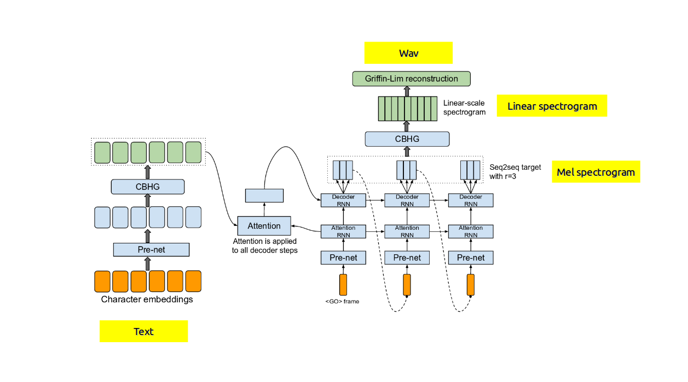
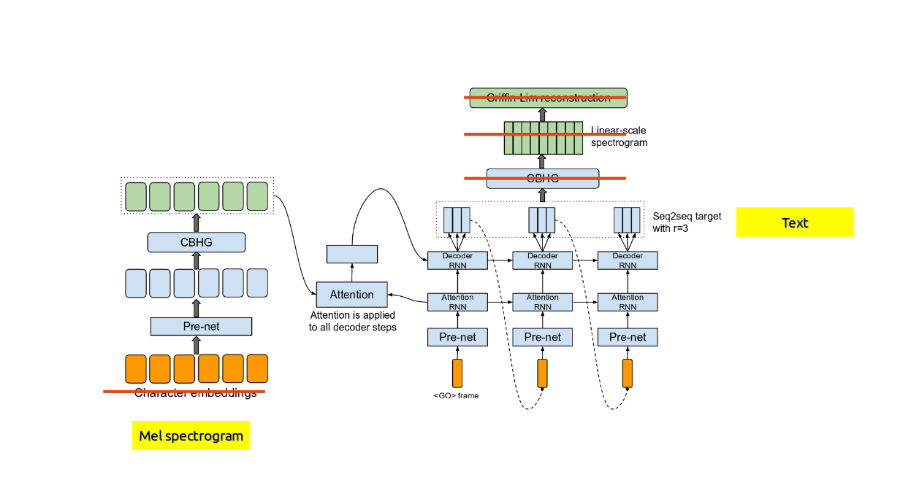
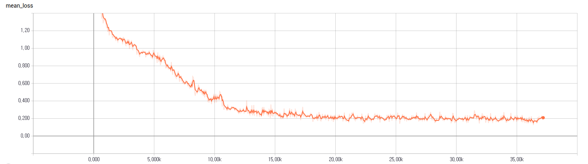

# Speech Recognition Using Tacotron

## Motivation
Tacotron is an end-to-end speech generation model which was first introduced in [Towards End-to-End Speech Synthesis](https://arxiv.org/abs/1703.10135). It takes as input text at the character level, and targets mel filterbanks and the linear spectrogram. Although it is a generation model, I felt like testing how well it can be applied to the speech recognition task.

## Requirements
  * NumPy >= 1.11.1
  * TensorFlow == 1.1
  * librosa

## Model description

Tacotron—Speech Synthesis Model (From_ Figure 1 in [Towards End-to-End Speech Synthesis](https://arxiv.org/abs/1703.10135))

Modified architecture for speech recognition

## Data

[The World English Bible](https://en.wikipedia.org/wiki/World_English_Bible) is a public domain update of the American Standard Version of 1901 into modern English. Its text and audio recordings are freely available [here](http://www.audiotreasure.com/webindex.htm). Unfortunately, however, each of the audio files matches a chapter, not a verse, so is too long for many machine learning tasks. I had someone slice them by verse manually. You can download [the audio data](https://dl.dropboxusercontent.com/u/42868014/WEB.zip) and its [text](https://dl.dropboxusercontent.com/u/42868014/text.csv) from my dropbox.

## File description
  * `hyperparams.py` includes all hyper parameters.
  * `prepro.py` creates training and evaluation data to `data/` folder.
  * `data_load.py` loads data and put them in queues so multiple mini-bach data are generated in parallel.
  * `utils.py` has some operational functions.
  * `modules.py` contains building blocks for encoding and decoding networks.
  * `networks.py` defines encoding and decoding networks.
  * `train.py` executes training.
  * `eval.py` executes evaluation.

## Training
  * STEP 1. Adjust hyper parameters in `hyperparams.py` if necessary.
  * STEP 2. Download and extract [the audio data](https://dl.dropboxusercontent.com/u/42868014/WEB.zip) and its [text](https://dl.dropboxusercontent.com/u/42868014/text.csv).
  * STEP 3. Run `train.py`. Or you can download my [pretrained file](https://www.dropbox.com/s/n55aqjx6mge96pb/logdir.zip?dl=0)

## Evaluation
  * Run `eval.py` to get speech recognition results for the test set.

## Results

The **training curve** looks like

**Sample results** are

Expected: the third poured out his bowl into the rivers and springs of water and they became blood 
Got     : the first will lie down to the rivers and springs of waters and it became blood

Expected: i heard the altar saying yes lord god the almighty true and righteous are your judgments 
Got     : i heard the altar saying yes were like your own like you tree in righteousness for your judgments

Expected: the fourth poured out his bowl on the sun and it was given to him to scorch men with fire 
Got     : the foolish very armed were on the sun and was given to him to spoke to him with fire

Expected: he gathered them together into the place which is called in hebrew megiddo 
Got     : he gathered them together into the place which is called and he weep and at every

Expected: every island fled away and the mountains were not found 
Got     : hadad and kedemoth aroen and another and spread out them

Expected: here is the mind that has wisdom the seven heads are seven mountains on which the woman sits 
Got     : he is the mighty have wisdom the seven heads of seven rountains are with the wind sixter

Expected: these have one mind and they give their power and authority to the beast 
Got     : these are those who are mine and they give holl of a fool in the deeps

Expected: the woman whom you saw is the great city which reigns over the kings of the earth 
Got     : the woman whom he saw it his degrection which ran and to advening to be ear

Expected: for her sins have reached to the sky and god has remembered her iniquities 
Got     : for he sends a least in the sky and god has remembered her iniquities

Expected: the merchants of the earth weep and mourn over her for no one buys their merchandise any more 
Got     : the mittites of the earth weeps in your own are before from knowing babylon busine backsliding all t

Expected: and cried out as they looked at the smoke of her burning saying 'what is like the great city' 
Got     : and cried all the wicked beside of a good one and saying when is like the great sight

Expected: in her was found the blood of prophets and of saints and of all who have been slain on the earth 
Got     : and her with stones a dwellified confidence and all who have been slain on the earth

Expected: a second said hallelujah her smoke goes up forever and ever 
Got     : as set him said how many men utter for smoke go down for every male it

Expected: he is clothed in a garment sprinkled with blood his name is called the word of god 
Got     : he is close in a garment speaking in the blood his name is called 'the word of god'

Expected: the armies which are in heaven followed him on white horses clothed in white pure fine linen 
Got     : the army which are in heaven falls on the mighty one horses clothes driven on the affliction

Expected: he has on his garment and on his thigh a name written king of kings and lord of lords 
Got     : he has understandings on his folly among widow the king of kings and yahweh of armies

Expected: i saw an angel coming down out of heaven having the key of the abyss and a great chain in his hand 
Got     : i saw an even become young lion having you trust of the ages and a great chamber is hand

Expected: and after the thousand years satan will be released from his prison 
Got     : and after the palace and mizpah and eleven eleenth were the twentieth

Expected: death and hades were thrown into the lake of fire this is the second death the lake of fire 
Got     : let them hate with one and to wait for fire this is the second death and lead a time

Expected: if anyone was not found written in the book of life he was cast into the lake of fire 
Got     : the ten man will not think within your demon as with a blood he will cast him to ram for fire

Expected: he who overcomes i will give him these things i will be his god and he will be my son 
Got     : he who recompenses i will give him be stings i will be his god and he will be my son

Expected: its wall is one hundred fortyfour cubits by the measure of a man that is of an angel 
Got     : is through all his womb home before you for accusation that we may know him by these are in egypt

Expected: the construction of its wall was jasper the city was pure gold like pure glass 
Got     : if he struck him of his wallor is not speaking with torment hold on her grass

Expected: i saw no temple in it for the lord god the almighty and the lamb are its temple 
Got     : i saw in a tenth wind for we will dry up you among the linen ox skillful

Expected: its gates will in no way be shut by day for there will be no night there 
Got     : his greech wind more redeems shameful the redeemer man don't know

Expected: and they shall bring the glory and the honor of the nations into it so that they may enter 
Got     : and they shall bring the glory in the high mountains and the egyptian into the midst of the needy

Expected: they will see his face and his name will be on their foreheads 
Got     : they will see his face and his name on their follows

Expected: behold i come quickly blessed is he who keeps the words of the prophecy of this book 
Got     : behold i happened with me when i could see me to still it is a prophet his bueld

Expected: he said to me don't seal up the words of the prophecy of this book for the time is at hand 
Got     : he said to him why sil with the words of the prophets it is book for the times and her

Expected: behold i come quickly my reward is with me to repay to each man according to his work 
Got     : behold i come perfect i yahweh is with me to repent to be shamed according to his work

Expected: i am the alpha and the omega the first and the last the beginning and the end 
Got     : i have you hope from you and you and the first from aloes of the dew and the enemy

Expected: he who testifies these things says yes i come quickly amen yes come lord jesus 
Got     : he who testifies these things says yes i come proclaim i man listen will jesus

## Related projects
  * [A TensorFlow Implementation of Tacotron: A Fully End-to-End Text-To-Speech Synthesis Model](https://github.com/Kyubyong/tacotron)
  * [Speech-to-Text-WaveNet : End-to-end sentence level English speech recognition based on DeepMind's WaveNet and tensorflow](https://github.com/buriburisuri/speech-to-text-wavenet)

